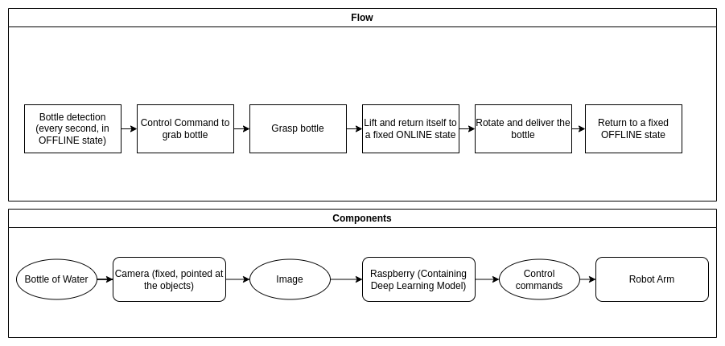

# GimmeAHand
This is the implementation of a module to use Rasberry Pi to control a robot arm to grasp a bottle or vase and deliver it to the user. For the details on the project see ```documents/full_report.pdf```. For the demos, see [Naive Controls](https://www.youtube.com/watch?v=7ggjaEWMQIM&t=6s) and [Segmented Controls](https://www.youtube.com/watch?v=T55dUDQz37s).



# Install
This repo is installed on a Rasberry Pi 4B 8G, Debian OS 64bit. 

```
git clone https://github.com/BatmanofZuhandArrgh/GimmeAHand.git
cd GimmeAHand
```

Create a virtual environment with venv
```
python3 -m venv robot_env
source robot_env/bin/activate
```

Install opencv, then run 
```
pip install -r requirements.txt
```
Assuming the system has already been installed with picamera2 and libcamera.
